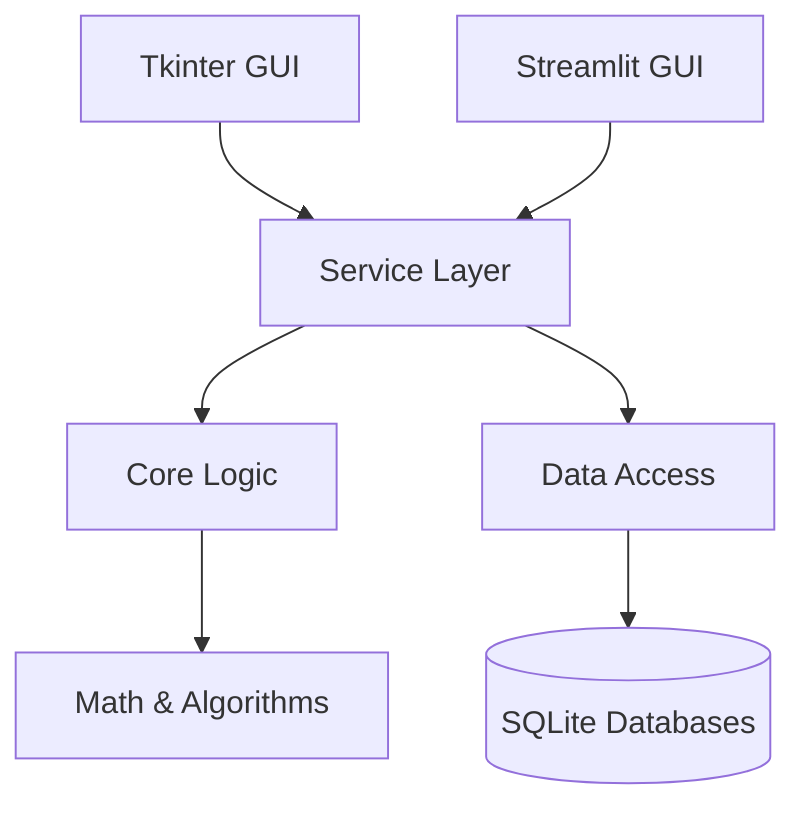

# System Architecture

The Data Entry KPI system follows a modular, layered architecture designed to support multiple front-ends (Tkinter, Streamlit) while sharing a robust core for data processing and logic.

## 🏗️ High-Level Structure

## 📂 Module Breakdown

### 1. Interfaces (`src/interfaces/`)
The presentation layer is split into two distinct applications:
- **`tkinter_app/`**: A stateful desktop application using `ttk.Notebook` for tabbed navigation. It directly instantiates persistent controller classes for each tab.
- **`streamlit_app/`**: A stateless web application. It uses a component-based structure where each "page" is a function re-executed on interaction. It relies on `st.session_state` for persistence.

### 2. Services (`src/services/`, `src/kpi_management/`, `src/target_management/`)
This layer orchestrates business operations:
- **`target_management.annual`**: The brain of the system. It handles the "Save" operation, dependency resolution, formula evaluation, and triggers the repartition engine.
- **`target_management.repartition`**: Responsible for the mathematical breakdown of annual targets into daily/weekly/monthly values. It now includes "On-the-Fly" evaluation for formula KPIs.
- **`kpi_management.*`**: Modules for CRUD operations on the KPI hierarchy (Groups, Subgroups, Indicators, Templates).
- **`services.split_analyzer`**: A specialized service for Multivariate Regression analysis, used to predict seasonality weights.

### 3. Core Logic (`src/core/`)
- **`node_engine.py`**: A framework-agnostic Directed Acyclic Graph (DAG) engine. It parses, validates, and evaluates KPI formulas. It supports both string-based (Python-like) and JSON-based (Node Editor) representations.

### 4. Data Access (`src/data_retriever.py`, `src/data_access/`)
- **`data_retriever.py`**: A facade for **Read** operations. It provides optimized queries for UI consumption (e.g., fetching full hierarchies, joining plant names).
- **`db_core/`**: Handles database initialization (`setup.py`) and schema migrations.

## 🔄 Data Flow: Target Calculation

1.  **User Input**: User saves an annual target in the GUI.
2.  **Orchestration (`save_annual_targets`)**:
    -   Saves the raw annual value.
    -   **Topological Sort**: Determines the calculation order based on KPI dependencies.
    -   **Evaluation**: Iteratively calculates formula-based KPIs using the `node_engine`.
    -   **Distribution**: Distributes "Master" targets to "Sub" KPIs based on defined weights.
3.  **Repartition (`calculate_and_save_all_repartitions`)**:
    -   For each updated KPI, the system calculates daily values.
    -   **Rule-Based**: Uses selected profiles (e.g., Sinusoidal) and logic (e.g., Monthly weights).
    -   **Formula-Based**: Evaluates the formula *for each day*, using the daily values of dependency KPIs.
    -   **Reconciliation**: Adjusts daily values to ensure their sum/mean exactly matches the annual target.
4.  **Persistence**: Aggregated results (Weekly, Monthly, Quarterly) are stored in dedicated SQLite tables for fast retrieval.

## 🛠️ Key Technologies

-   **Backend**: Python 3.10+
-   **Database**: SQLite (split into multiple files: `db_kpis.db`, `db_kpi_targets.db`, `db_kpi_days.db`, etc. to manage file size and locking).
-   **Math**: `numpy` for vectorized distribution calculations, `pandas` for data analysis.
-   **Plotting**: `matplotlib` (Tkinter) and `plotly` (Streamlit).
