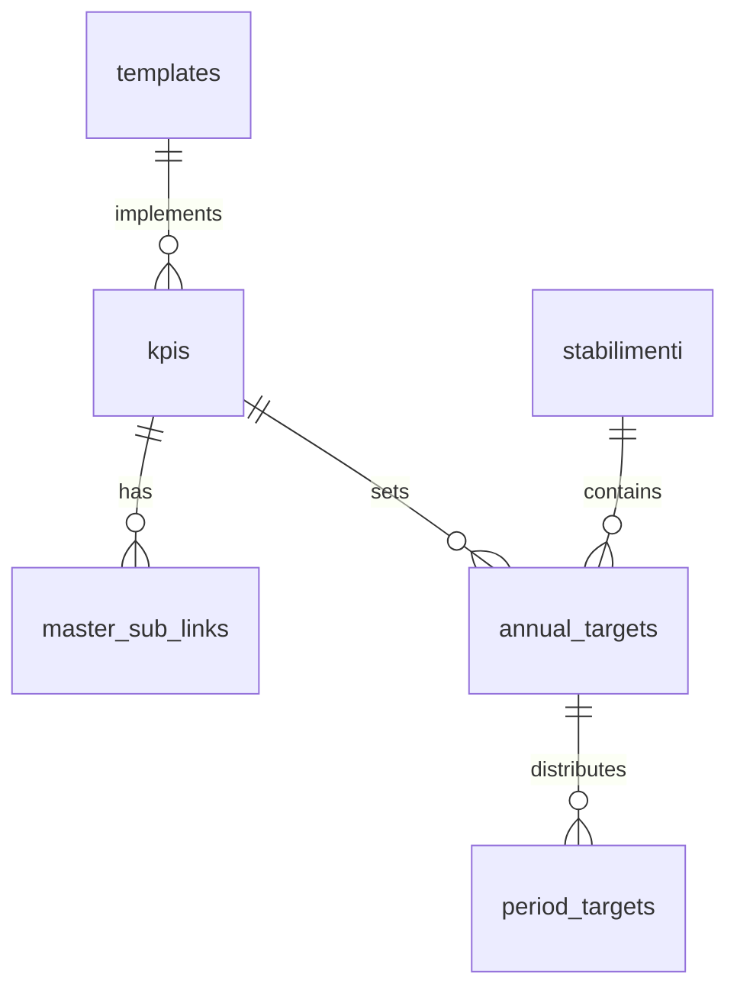

# Database Schema Documentation

## Overview

The system uses multiple SQLite databases to manage different aspects of KPI data:

```
databases/
├── db_kpi_templates.db  # KPI definitions and templates
├── db_kpis.db          # KPI specifications and relationships
├── db_kpi_targets.db   # Target values and formulas
├── db_kpi_days.db      # Daily values
├── db_kpi_weeks.db     # Weekly aggregations
├── db_kpi_months.db    # Monthly aggregations
└── db_kpi_quarters.db  # Quarterly aggregations
```

## Schema Details

### 1. KPI Templates (db_kpi_templates.db)

#### templates
```sql
CREATE TABLE templates (
    id INTEGER PRIMARY KEY,
    name TEXT NOT NULL,
    description TEXT,
    calculation_type TEXT NOT NULL,  -- 'INCREMENTALE' or 'MEDIA'
    base_unit TEXT,
    created_at TIMESTAMP DEFAULT CURRENT_TIMESTAMP,
    updated_at TIMESTAMP DEFAULT CURRENT_TIMESTAMP
);
```

### 2. KPI Specifications (db_kpis.db)

#### kpis
```sql
CREATE TABLE kpis (
    id INTEGER PRIMARY KEY,
    template_id INTEGER,
    description TEXT,
    calculation_type TEXT,
    unit_of_measure TEXT,
    visible BOOLEAN DEFAULT TRUE,
    master_kpi_id INTEGER NULL,  -- For sub-KPIs
    FOREIGN KEY (template_id) REFERENCES templates(id),
    FOREIGN KEY (master_kpi_id) REFERENCES kpis(id)
);
```

#### master_sub_links
```sql
CREATE TABLE master_sub_links (
    master_kpi_id INTEGER,
    sub_kpi_id INTEGER,
    weight REAL NOT NULL,
    FOREIGN KEY (master_kpi_id) REFERENCES kpis(id),
    FOREIGN KEY (sub_kpi_id) REFERENCES kpis(id),
    PRIMARY KEY (master_kpi_id, sub_kpi_id)
);
```

### 3. Targets (db_kpi_targets.db)

#### annual_targets
```sql
CREATE TABLE annual_targets (
    id INTEGER PRIMARY KEY,
    kpi_id INTEGER,
    stabilimento_id INTEGER,
    year INTEGER,
    annual_target1 REAL,
    annual_target2 REAL,
    is_target1_manual BOOLEAN DEFAULT TRUE,
    is_target2_manual BOOLEAN DEFAULT TRUE,
    target1_is_formula_based BOOLEAN DEFAULT FALSE,
    target2_is_formula_based BOOLEAN DEFAULT FALSE,
    target1_formula TEXT,
    target2_formula TEXT,
    target1_formula_inputs TEXT, -- JSON array
    target2_formula_inputs TEXT, -- JSON array
    distribution_profile TEXT DEFAULT 'EVEN',
    repartition_logic TEXT DEFAULT 'ANNO',
    repartition_values TEXT,  -- JSON object
    profile_params TEXT,      -- JSON object
    FOREIGN KEY (kpi_id) REFERENCES kpis(id),
    FOREIGN KEY (stabilimento_id) REFERENCES stabilimenti(id)
);
```

### 4. Period Values (db_kpi_*.db)

All period databases share a similar structure:

#### targets
```sql
CREATE TABLE targets (
    id INTEGER PRIMARY KEY,
    kpi_id INTEGER,
    stabilimento_id INTEGER,
    period_start DATE,
    period_end DATE,
    target1 REAL,
    target2 REAL,
    is_manual BOOLEAN DEFAULT FALSE,
    FOREIGN KEY (kpi_id) REFERENCES kpis(id),
    FOREIGN KEY (stabilimento_id) REFERENCES stabilimenti(id)
);
```

## Relationships



## Data Flow

1. **Template Definition**
   - Create base KPI templates
   - Define calculation types and units

2. **KPI Specification**
   - Implement templates as concrete KPIs
   - Set up master/sub relationships
   - Configure visibility and units

3. **Target Setting**
   - Set annual targets
   - Define distribution profiles
   - Configure formulas if needed

4. **Period Distribution**
   - System calculates period values
   - Stores in respective databases
   - Maintains hierarchical consistency

## Optimization Notes

1. **Indexing**
   ```sql
   CREATE INDEX idx_kpi_period ON targets(kpi_id, period_start, period_end);
   CREATE INDEX idx_stab_period ON targets(stabilimento_id, period_start);
   ```

2. **Triggers**
   - Maintain updated_at timestamps
   - Enforce data consistency
   - Cascade updates where needed

3. **Views**
   ```sql
   CREATE VIEW v_kpi_hierarchy AS
   SELECT k.*, t.name as template_name, 
          mk.description as master_description
   FROM kpis k
   LEFT JOIN templates t ON k.template_id = t.id
   LEFT JOIN kpis mk ON k.master_kpi_id = mk.id;
   ```

## Backup and Maintenance

1. **Backup Strategy**
   ```bash
   # Daily backups
   sqlite3 db_kpi_targets.db ".backup 'backup/targets_$(date +%Y%m%d).db'"
   ```

2. **Optimization**
   ```sql
   VACUUM;  -- Reclaim space
   ANALYZE; -- Update statistics
   ```

## See Also

- [Target Generation](target_generation.md) for distribution logic
- [Architecture Overview](architecture.md) for system design
- [Theoretical Framework](theoretical_framework.md) for mathematical models
