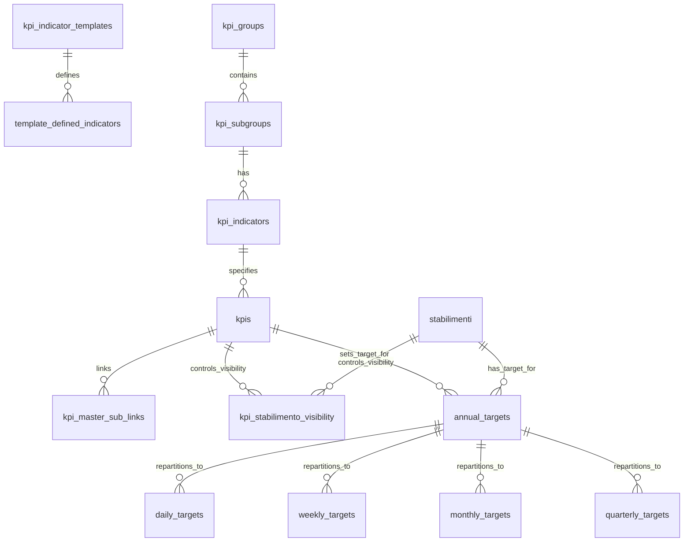

# Database Schema Documentation

## Overview

The system uses multiple SQLite databases to manage different aspects of KPI data:

```
databases/
├── db_kpi_templates.db  # KPI definitions and templates
├── db_kpis.db          # KPI specifications and relationships
├── db_kpi_targets.db   # Target values and formulas
├── db_kpi_days.db      # Daily values
├── db_kpi_weeks.db     # Weekly aggregations
├── db_kpi_months.db    # Monthly aggregations
└── db_kpi_quarters.db  # Quarterly aggregations
├── db_stabilimenti.db  # Stabilimenti (Plants/Locations) data
```

## Schema Details

### 1. KPI Templates (db_kpi_templates.db)

#### kpi_indicator_templates
```sql
CREATE TABLE kpi_indicator_templates (
    id INTEGER PRIMARY KEY AUTOINCREMENT,
    name TEXT NOT NULL UNIQUE,
    description TEXT
);
```

#### template_defined_indicators
```sql
CREATE TABLE template_defined_indicators (
    id INTEGER PRIMARY KEY AUTOINCREMENT,
    template_id INTEGER NOT NULL,
    indicator_name_in_template TEXT NOT NULL,
    default_description TEXT,
    default_calculation_type TEXT NOT NULL,
    default_unit_of_measure TEXT,
    default_visible BOOLEAN NOT NULL DEFAULT 1,
    FOREIGN KEY (template_id) REFERENCES kpi_indicator_templates(id) ON DELETE CASCADE,
    UNIQUE (template_id, indicator_name_in_template)
);
```

### 2. KPI Specifications (db_kpis.db)

#### kpi_groups
```sql
CREATE TABLE kpi_groups (
    id INTEGER PRIMARY KEY AUTOINCREMENT,
    name TEXT NOT NULL UNIQUE
);
```

#### kpi_subgroups
```sql
CREATE TABLE kpi_subgroups (
    id INTEGER PRIMARY KEY AUTOINCREMENT,
    name TEXT NOT NULL,
    group_id INTEGER NOT NULL,
    indicator_template_id INTEGER,
    FOREIGN KEY (group_id) REFERENCES kpi_groups(id) ON DELETE CASCADE,
    FOREIGN KEY (indicator_template_id) REFERENCES kpi_indicator_templates(id) ON DELETE SET NULL,
    UNIQUE (name, group_id)
);
```

#### kpi_indicators
```sql
CREATE TABLE kpi_indicators (
    id INTEGER PRIMARY KEY AUTOINCREMENT,
    name TEXT NOT NULL,
    subgroup_id INTEGER NOT NULL,
    FOREIGN KEY (subgroup_id) REFERENCES kpi_subgroups(id) ON DELETE CASCADE,
    UNIQUE (name, subgroup_id)
);
```

#### kpis
```sql
CREATE TABLE kpis (
    id INTEGER PRIMARY KEY AUTOINCREMENT,
    indicator_id INTEGER NOT NULL,
    description TEXT,
    calculation_type TEXT NOT NULL,
    unit_of_measure TEXT,
    visible BOOLEAN NOT NULL DEFAULT 1,
    FOREIGN KEY (indicator_id) REFERENCES kpi_indicators(id) ON DELETE CASCADE,
    UNIQUE (indicator_id)
);
```

#### kpi_master_sub_links
```sql
CREATE TABLE kpi_master_sub_links (
    id INTEGER PRIMARY KEY AUTOINCREMENT,
    master_kpi_spec_id INTEGER NOT NULL,
    sub_kpi_spec_id INTEGER NOT NULL,
    distribution_weight REAL NOT NULL DEFAULT 1.0,
    FOREIGN KEY (master_kpi_spec_id) REFERENCES kpis(id) ON DELETE CASCADE,
    FOREIGN KEY (sub_kpi_spec_id) REFERENCES kpis(id) ON DELETE CASCADE,
    UNIQUE (master_kpi_spec_id, sub_kpi_spec_id)
);
```

#### kpi_stabilimento_visibility
```sql
CREATE TABLE kpi_stabilimento_visibility (
    kpi_id INTEGER NOT NULL,
    stabilimento_id INTEGER NOT NULL,
    is_enabled BOOLEAN NOT NULL DEFAULT 1,
    PRIMARY KEY (kpi_id, stabilimento_id),
    FOREIGN KEY (kpi_id) REFERENCES kpis(id) ON DELETE CASCADE,
    FOREIGN KEY (stabilimento_id) REFERENCES stabilimenti(id) ON DELETE CASCADE
);
```

### 3. Stabilimenti (db_stabilimenti.db)

#### stabilimenti
```sql
CREATE TABLE stabilimenti (
    id INTEGER PRIMARY KEY AUTOINCREMENT,
    name TEXT NOT NULL UNIQUE,
    description TEXT,
    visible BOOLEAN NOT NULL DEFAULT 1,
    color TEXT NOT NULL DEFAULT '#000000'
);
```

### 4. Targets (db_kpi_targets.db)

#### annual_targets
```sql
CREATE TABLE annual_targets (
    id INTEGER PRIMARY KEY AUTOINCREMENT,
    year INTEGER NOT NULL,
    stabilimento_id INTEGER NOT NULL,
    kpi_id INTEGER NOT NULL,
    annual_target1 REAL NOT NULL DEFAULT 0,
    annual_target2 REAL NOT NULL DEFAULT 0,
    repartition_logic TEXT NOT NULL DEFAULT 'ANNO',
    repartition_values TEXT NOT NULL DEFAULT '{}',
    distribution_profile TEXT NOT NULL DEFAULT 'ANNUAL_PROGRESSIVE',
    profile_params TEXT DEFAULT '{}',
    is_target1_manual BOOLEAN NOT NULL DEFAULT 0,
    is_target2_manual BOOLEAN NOT NULL DEFAULT 0,
    target1_is_formula_based BOOLEAN NOT NULL DEFAULT 0,
    target1_formula TEXT,
    target1_formula_inputs TEXT DEFAULT '[]',
    target2_is_formula_based BOOLEAN NOT NULL DEFAULT 0,
    target2_formula TEXT,
    target2_formula_inputs TEXT DEFAULT '[]',
    UNIQUE(year, stabilimento_id, kpi_id)
);
```

### 5. Period Values (db_kpi_days.db, db_kpi_weeks.db, db_kpi_months.db, db_kpi_quarters.db)

All period databases share a similar structure, with `date_value`, `week_value`, `month_value`, or `quarter_value` as the period column.

#### daily_targets (example for db_kpi_days.db)
```sql
CREATE TABLE daily_targets (
    id INTEGER PRIMARY KEY AUTOINCREMENT,
    year INTEGER NOT NULL,
    stabilimento_id INTEGER NOT NULL,
    kpi_id INTEGER NOT NULL,
    target_number INTEGER NOT NULL CHECK(target_number IN (1, 2)),
    date_value TEXT NOT NULL,
    target_value REAL NOT NULL,
    UNIQUE(year, stabilimento_id, kpi_id, target_number, date_value)
);
```

#### weekly_targets (example for db_kpi_weeks.db)
```sql
CREATE TABLE weekly_targets (
    id INTEGER PRIMARY KEY AUTOINCREMENT,
    year INTEGER NOT NULL,
    stabilimento_id INTEGER NOT NULL,
    kpi_id INTEGER NOT NULL,
    target_number INTEGER NOT NULL CHECK(target_number IN (1, 2)),
    week_value TEXT NOT NULL,
    target_value REAL NOT NULL,
    UNIQUE(year, stabilimento_id, kpi_id, target_number, week_value)
);
```

#### monthly_targets (example for db_kpi_months.db)
```sql
CREATE TABLE monthly_targets (
    id INTEGER PRIMARY KEY AUTOINCREMENT,
    year INTEGER NOT NULL,
    stabilimento_id INTEGER NOT NULL,
    kpi_id INTEGER NOT NULL,
    target_number INTEGER NOT NULL CHECK(target_number IN (1, 2)),
    month_value TEXT NOT NULL,
    target_value REAL NOT NULL,
    UNIQUE(year, stabilimento_id, kpi_id, target_number, month_value)
);
```

#### quarterly_targets (example for db_kpi_quarters.db)
```sql
CREATE TABLE quarterly_targets (
    id INTEGER PRIMARY KEY AUTOINCREMENT,
    year INTEGER NOT NULL,
    stabilimento_id INTEGER NOT NULL,
    kpi_id INTEGER NOT NULL,
    target_number INTEGER NOT NULL CHECK(target_number IN (1, 2)),
    quarter_value TEXT NOT NULL,
    target_value REAL NOT NULL,
    UNIQUE(year, stabilimento_id, kpi_id, target_number, quarter_value)
);
```

## Relationships



## Data Flow

1.  **Template Definition**
    *   Create base KPI templates (`kpi_indicator_templates`)
    *   Define default indicators within templates (`template_defined_indicators`)

2.  **KPI Specification**
    *   Organize KPIs into groups (`kpi_groups`) and subgroups (`kpi_subgroups`)
    *   Define concrete KPI indicators (`kpi_indicators`)
    *   Create KPI specifications (`kpis`) linking to indicators and defining properties
    *   Set up master/sub relationships (`kpi_master_sub_links`)
    *   Control per-stabilimento visibility (`kpi_stabilimento_visibility`)

3.  **Target Setting**
    *   Set annual targets for KPIs per stabilimento (`annual_targets`)
    *   Define distribution profiles and formulas

4.  **Period Distribution**
    *   System calculates daily, weekly, monthly, and quarterly values based on annual targets and distribution rules
    *   Stores in respective databases (`db_kpi_days.db`, `db_kpi_weeks.db`, etc.)

## Optimization Notes

1.  **Indexing**
    ```sql
    -- Example indexes, actual indexes depend on query patterns
    CREATE INDEX idx_annual_targets_kpi_stab_year ON annual_targets(kpi_id, stabilimento_id, year);
    CREATE INDEX idx_daily_targets_kpi_stab_year_date ON daily_targets(kpi_id, stabilimento_id, year, date_value);
    -- Add similar indexes for weekly, monthly, quarterly targets
    CREATE INDEX idx_kpi_stabilimento_visibility ON kpi_stabilimento_visibility(kpi_id, stabilimento_id);
    ```

2.  **Triggers**
    *   Maintain `updated_at` timestamps (if added to tables)
    *   Enforce data consistency
    *   Cascade updates/deletes where needed (already defined in FKs)

3.  **Views**
    ```sql
    -- Example view for KPI hierarchy
    CREATE VIEW v_kpi_full_hierarchy AS
    SELECT
        kg.name AS group_name,
        ksg.name AS subgroup_name,
        kit.name AS template_name,
        ki.name AS indicator_name,
        k.description,
        k.calculation_type,
        k.unit_of_measure,
        k.visible,
        k.id AS kpi_spec_id
    FROM kpis k
    JOIN kpi_indicators ki ON k.indicator_id = ki.id
    JOIN kpi_subgroups ksg ON ki.subgroup_id = ksg.id
    JOIN kpi_groups kg ON ksg.group_id = kg.id
    LEFT JOIN kpi_indicator_templates kit ON ksg.indicator_template_id = kit.id;
    ```

## Backup and Maintenance

1.  **Backup Strategy**
    ```bash
    # Example: Daily backups for all databases
    sqlite3 databases/db_kpi_templates.db ".backup 'backup/db_kpi_templates_$(date +%Y%m%d).db'"
    sqlite3 databases/db_kpis.db ".backup 'backup/db_kpis_$(date +%Y%m%d).db'"
    sqlite3 databases/db_kpi_targets.db ".backup 'backup/db_kpi_targets_$(date +%Y%m%d).db'"
    sqlite3 databases/db_kpi_days.db ".backup 'backup/db_kpi_days_$(date +%Y%m%d).db'"
    sqlite3 databases/db_kpi_weeks.db ".backup 'backup/db_kpi_weeks_$(date +%Y%m%d).db'"
    sqlite3 databases/db_kpi_months.db ".backup 'backup/db_kpi_months_$(date +%Y%m%d).db'"
    sqlite3 databases/db_kpi_quarters.db ".backup 'backup/db_kpi_quarters_$(date +%Y%m%d).db'"
    sqlite3 databases/db_stabilimenti.db ".backup 'backup/db_stabilimenti_$(date +%Y%m%d).db'"
    ```

2.  **Optimization**
    ```sql
    VACUUM;  -- Reclaim space
    ANALYZE; -- Update statistics
    ```

## See Also

-   [Target Generation](target_generation.md) for distribution logic
-   [Architecture Overview](architecture.md) for system design
-   [Theoretical Framework](theoretical_framework.md) for mathematical models