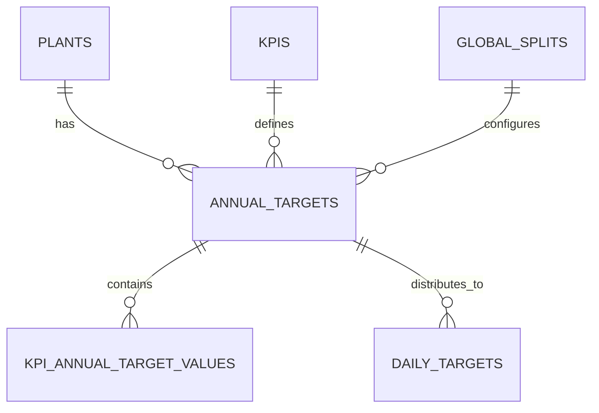

# Database Schema Documentation

The system utilizes a distributed SQLite architecture. Data is partitioned across multiple database files to optimize performance and manage logical separation.

## 🗄️ Database Files (`databases/`)

- **`db_kpis.db`**: Stores the structural definitions (Hierarchy, Specs, Links).
- **`db_plants.db`**: Stores facility data.
- **`db_kpi_targets.db`**: Stores annual target values and formula configurations.
- **`db_kpi_templates.db`**: Stores reusable KPI templates.
- **`db_kpi_days.db`, `_weeks.db`, `_months.db`, `_quarters.db`**: Store distributed periodic values.

## 📋 Schema Details

### 1. Structure (`db_kpis.db`)

#### `kpis`
The central definition table for metrics.
- `id` (PK): Unique KPI Specification ID.
- `indicator_id` (FK): Link to the name/node.
- `calculation_type`: 'Incremental' (Sum) or 'Average' (Mean).
- `unit_of_measure`: e.g., "kg", "%", "hours".
- `visible`: Global visibility flag.

### 2. Targets (`db_kpi_targets.db`)

#### `annual_targets`
The primary table for user input.
- `year`, `plant_id`, `kpi_id`: Composite unique key.
- `repartition_logic`: Enum ('Year', 'Month', 'Quarter', 'Week').
- `distribution_profile`: Enum ('Even', 'Sinusoidal', 'Progressive', etc.).
- `repartition_values`: JSON string storing custom weights (e.g., `{"January": 10.5, "February": 12...}`).
- `global_split_id`: (FK, Nullable) Link to a Global Split template. If set, overrides logic/profile/values.

#### `kpi_annual_target_values`
Normalized storage for dynamic targets (allows scaling beyond 2 targets).
- `annual_target_id` (FK): Link to parent record.
- `target_number`: Integer (1, 2, 3...).
- `target_value`: The calculated or entered value.
- `is_manual`: Boolean override flag.

### 3. Periodic Data (`db_kpi_*.db`)

#### `daily_targets` (in `db_kpi_days.db`)
- `date_value`: ISO Date string (YYYY-MM-DD).
- `target_value`: The precise value for that specific day.
- `kpi_id`, `plant_id`, `target_number`.

*Note: Weekly, Monthly, and Quarterly tables follow the same structure with their respective period keys.*

## 🔄 Relationships

```mermaid
erDiagram
    PLANTS ||--o{ ANNUAL_TARGETS : "has"
    KPIS ||--o{ ANNUAL_TARGETS : "defines"
    GLOBAL_SPLITS ||--o{ ANNUAL_TARGETS : "configures"
    
    ANNUAL_TARGETS ||--o{ KPI_ANNUAL_TARGET_VALUES : "contains"
    ANNUAL_TARGETS ||--o{ DAILY_TARGETS : "distributes_to"
```
