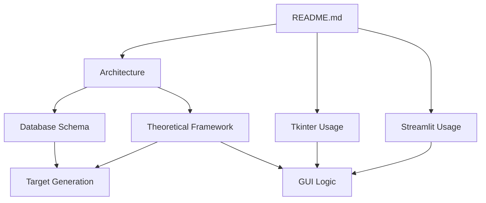

# Data Entry KPI Documentation Index

## Product Documentation

1. [Product Requirements Document (PRD)](product_requirements.md)
   - Project Goals
   - User Stories / Features
   - Technical Requirements
   - Non-Functional Requirements

## Core Documentation

1. [System Architecture](architecture.md)
   - System overview
   - Component interactions
   - Extension points

2. [Theoretical Framework](theoretical_framework.md)
   - Mathematical models
   - Distribution algorithms
   - Formula evaluation

3. [Target Generation](target_generation.md)
   - Distribution profiles
   - Period hierarchies
   - Implementation details

4. [Database Schema](database_schema.md)
   - Table structures
   - Relationships
   - Optimization

## User Guides

1. [Tkinter Desktop Interface](usage_tkinter.md)
   - Installation
   - Basic usage
   - Advanced features

2. [Streamlit Web Interface](usage_streamlit.md)
   - Setup
   - Features
   - Best practices

## Technical Reference

1. [GUI Logic](GUI's%20logic.txt)
   - Event handling
   - State management
   - Component interactions

2. [Configuration Guide](configuration.md)
   - Settings overview
   - Customization options
   - Environment setup

## Quick Links

### For Users
- [Quick Start Guide](README.md#quick-start)
- [Features Overview](README.md#core-features)
- [Troubleshooting](usage_streamlit.md#troubleshooting)

### For Developers
- [Architecture Overview](architecture.md#overview)
- [Database Schema](database_schema.md)
- [API Reference](api_reference.md)
- [Extension Points](architecture.md#extension-points)

### For Data Analysts
- [Mathematical Models](theoretical_framework.md#target-distribution-mathematics)
- [Distribution Profiles](target_generation.md#distribution-profiles)
- [Formula Reference](theoretical_framework.md#formula-based-targets)

## Document Relationships

## Reading Order

1. New Users
   - README.md
   - usage_streamlit.md or usage_tkinter.md
   - target_generation.md (basic concepts)

2. Developers
   - architecture.md
   - database_schema.md
   - theoretical_framework.md
   - GUI's logic.txt

3. Data Scientists
   - theoretical_framework.md
   - target_generation.md
   - database_schema.md
